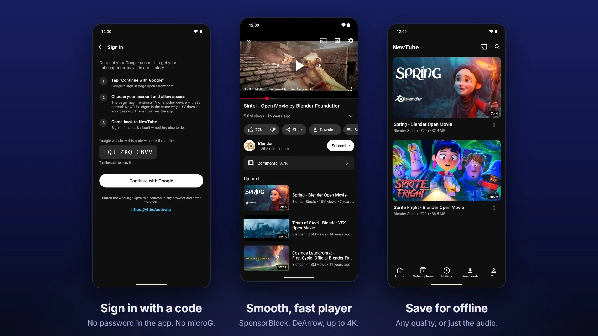
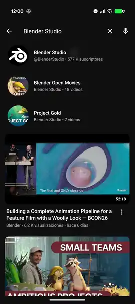
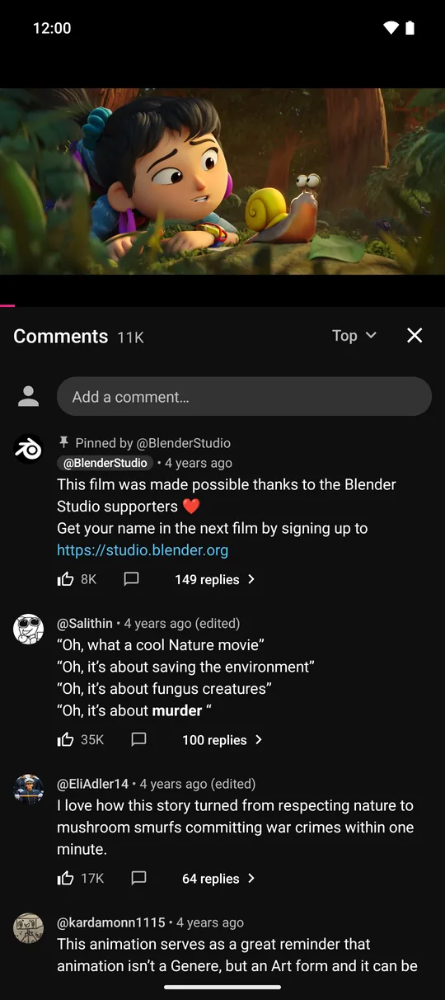
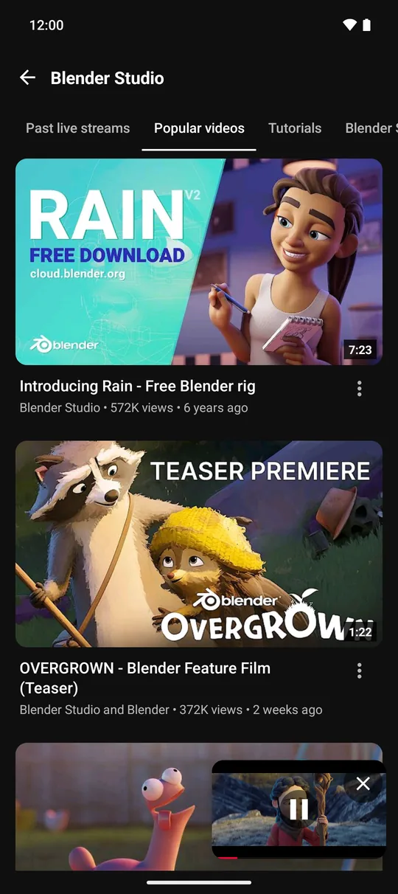
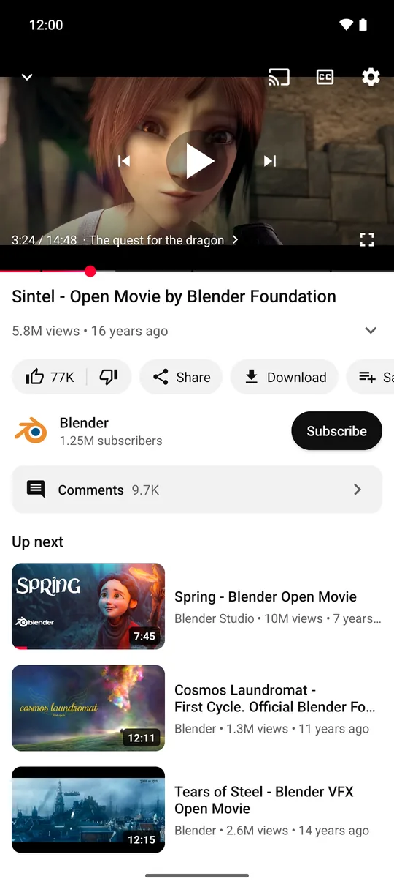

# NewTube

### Built on SmartTube. Made for your phone.

**SmartTube for phones**, unofficial: a YouTube client for Android phones and tablets, built on
[SmartTube](https://github.com/yuliskov/SmartTube) by [@yuliskov](https://github.com/yuliskov). 
Sign in with a code, keep it playing in the background, save videos for offline,
and cast to SmartTube on your TV.

**[Website](https://newtube.org/) · [Download](#download) · [Features](#features) · [How sign-in works](#how-sign-in-works) · [FAQ](#faq) · [Translate](#translate) · [Credits](#built-on-smarttube)**

 

> [!NOTE]
> **NewTube is SmartTube's work underneath.** The engine that talks to YouTube, the account
> sign-in and the SponsorBlock, DeArrow and Return YouTube Dislike integrations all come from
> [SmartTube](https://github.com/yuliskov/SmartTube). NewTube adds a touch interface, its own
> player and offline saving. It is an independent project, not endorsed by SmartTube's developer.
> NewTube takes no donations: if you find it useful, [support SmartTube](https://github.com/yuliskov/SmartTube#donation).

## Features

<table>
<tr>
<td width="50%" valign="top">

#### Your account, in seconds
Sign in once with a code and your subscriptions, history, playlists, Watch later and
recommendations load from your account. It doesn't need microG, GmsCore, root or a patched app.
Signing in is optional; signed out, YouTube still personalises Home from what you watch.

</td>
<td width="50%" valign="top">

#### Keeps playing
Background playback with the screen off, picture-in-picture, and a mini-player you can
drag down while you keep browsing. Lock-screen and headset controls work too.

</td>
</tr>
<tr>
<td valign="top">

#### Save for offline
Pick a quality up to 1080p, or keep only the audio. Saved videos play in the same player
with no connection, and they show up in your gallery.

</td>
<td valign="top">

#### Measured speed
The first screen appears in about 0.24 s, and a related video shows its first frame about half
a second after you tap it ([Pixel 9 medians](#how-fast)). The interface is plain Material Design,
in light or dark.

</td>
</tr>
<tr>
<td valign="top">

#### Less noise
**SponsorBlock** skips sponsor segments, **DeArrow** swaps clickbait titles and thumbnails,
and **Return YouTube Dislike** shows estimated dislike counts. There are no Shorts.

</td>
<td valign="top">

#### Works with SmartTube on your TV
Pair with SmartTube on the TV using its Remote control code. You can also play straight to a
Chromecast from the phone (no live streams or subtitles in that mode), or use the TV's own
YouTube app.

</td>
</tr>
</table>

<b>Everything else</b>

- Up to 4K where the video and the phone allow (1080p by default), with codec choice
- Subtitles, including auto-translated tracks, and caption style and size
- Playback speed from 0.25x to 2x, plus finer steps
- Playlists: Play all, Shuffle, Save to playlist, New playlist, a queue with "Playing from…"
- Several accounts, with a switcher, or none at all
- Picture-in-picture on Android 8 and later
- Swipe gestures: up into fullscreen, down out of it, brightness and volume on the sides, sideways to seek
- Settings in short pages, with a search
- Read and write comments, live chat; chapters and dubbed audio tracks
- Playback that waits out tunnels and dead zones and resumes where it stopped
- English and Spanish

## Download

| Your device | File |
|:--|:--|
| Almost every phone from the last ~8 years | `NewTube_<version>_arm64-v8a.apk` |
| Older 32-bit phones | `NewTube_<version>_armeabi-v7a.apk` |
| Not sure (any ARM phone) | `NewTube_<version>_universal.apk` (bigger) |
| Older x86 devices and emulators | `NewTube_<version>_x86.apk` |

- **Requires Android 7.0 or newer.** NewTube has its own package name
  (`io.github.aleixrodriala.arc`), so it installs next to SmartTube or the YouTube app.
- **Updates:** with [Obtainium](https://obtainium.imranr.dev), choose *Add app* and paste
  `https://github.com/aleixrodriala/newtube`, or install a newer APK over the old one. NewTube
  also checks for new versions itself and offers them in the app.
- **Verify what you install.** Every APK is signed with the same key. Its certificate SHA-256 is
  `2e:f9:9d:76:ed:fa:d9:88:ad:17:cd:ee:8b:a1:8c:63:4e:23:0f:e1:e3:cb:1f:dc:6c:db:02:49:37:0a:36:c9`.
  Check it with `apksigner verify --print-certs <file>.apk`. Each release also lists a SHA-256 for every file.
  From 1.10.3 the APKs are built by GitHub Actions from the tagged source; check that with
  `gh attestation verify <file>.apk -R aleixrodriala/newtube`.
  NewTube's key is not SmartTube's, so neither app can update the other.
- **Distributed on GitHub**, not on Google Play.

## How sign-in works

1. Open the **You** tab, tap the account row, then **Sign in**. NewTube shows a short code.
2. Tap **Continue with Google**. Google's own page opens: pick your account and allow access.
   It may mention a TV, because NewTube signs in the same way a TV does.
3. Come back. Sign-in finishes by itself.

Your password is only ever typed into Google's page, never into NewTube. The login token is
stored on your phone and never sent to the developer. You can revoke it at any time at
[myaccount.google.com/security](https://myaccount.google.com/security), under
*Your connections to third-party apps & services*.

## How fast

Medians measured on a Pixel 9 on 25 and 26 September 2026, with release builds of the code that
became 1.10.1, 2 to 8 runs per cell: small samples, one phone, one carrier, and the mobile-data runs
were on different days. Later versions haven't been re-timed this way, and 1.12.0 changed how the
app opens (Home shows loading placeholders first). The method and the full table are in
[STATUS.md](docs/mobile-port/STATUS.md).

| | Wi-Fi | Mobile data |
|:--|--:|--:|
| Open the app → first screen | 0.24 s | 0.24 s |
| Open the app → Home fully painted | 1.35 s | 1.56 s |
| Tap a related video → first frame | 0.50 s | 0.53 s |
| Tap a related video → picture visible | 0.66 s | 0.73 s |
| Reopen a half-watched video → picture | 0.37 s | – |
| Tap a shared link → first frame | 0.66 s | 0.84 s |

## NewTube and SmartTube

|  | SmartTube | NewTube |
|:--|:--|:--|
| Made for | Android TV and TV boxes | Phones and tablets |
| Controls | TV remote (D-pad) | Touch and gestures |
| Interface | Leanback | Material Design |
| Engine | MediaServiceCore + SharedModules | Forks of the same modules |
| Player | ExoPlayer | androidx Media3 |
| Offline saving | No | Yes |
| License | MIT | MIT |

Have an Android TV? Get [SmartTube](https://github.com/yuliskov/SmartTube). It's excellent,
and NewTube can cast to it.

## FAQ

<b>Can SmartTube be installed on phones?</b>

SmartTube is made for Android TV and TV boxes, and its README says "There will not be a phone
version." NewTube is an unofficial phone client built on SmartTube's engine, with a touch interface,
its own player and offline saving. It is an independent project, not endorsed by SmartTube's developer.

<b>Do I need microG, GmsCore, root or ReVanced?</b>

No. NewTube isn't a patched YouTube app. It signs in with a code the way a TV does, so it
doesn't need Google Play Services or a stand-in for them.

<b>How is it different from NewPipe, LibreTube or ReVanced?</b>

They're all good apps, and which one fits depends on what you want. NewPipe and LibreTube
don't sign in to a Google account; they keep subscriptions on your phone or on a Piped server.
ReVanced patches the official app and needs GmsCore unless you're rooted.
NewTube is built on SmartTube, so it uses your real account without any of that.

<b>Is there another SmartTube-based phone app?</b>

Yes. [SmarterTube](https://github.com/CodeSculptor/SmarterTube) is another independent phone
fork of SmartTube, worth comparing. The two are separate projects. One difference today
(September 2026): NewTube can save videos for offline.

<b>Is it safe? How do I know the APK is really NewTube?</b>

Up to 1.10.2 the APKs were built on the maintainer's computer. From 1.10.3 they're built by
GitHub Actions from the tagged source, and each file has a build attestation you can check with
`gh attestation verify <file>.apk -R aleixrodriala/newtube`. The builds aren't reproducible yet. Check the signing
certificate against the fingerprint under [Download](#download), and each file against the
SHA-256 in its release notes. Every release is tagged, so you can read the exact source.
The app has no analytics, no crash reporting and no ad SDKs, and the developer receives nothing.
It talks to YouTube (which sees what you watch, as it would anywhere), to the community services
you can switch off (SponsorBlock, DeArrow, Return YouTube Dislike), and to GitHub. Details are
in [PRIVACY.md](PRIVACY.md). Every check, with links, is also on the website under
[Trust and verification](https://newtube.org/#trust).

<b>Was this made with AI?</b>

Yes, in large part. NewTube is one person's project, and most of its own code (the phone
interface, the player and the network work) was written with AI coding assistants (Claude and
Codex); the commit trailers say so. The maintainer directs and reviews that work and uses the app
daily. Each [release record](docs/releases/) lists what was checked on a real phone, what only in
automated tests, and what is still open. The engine underneath is SmartTube's, written by
@yuliskov and its contributors over several years.

<b>Why no donations?</b>

NewTube doesn't take donations. SmartTube did the heavy lifting, so if you want to give
something back, [support SmartTube](https://github.com/yuliskov/SmartTube#donation).

<b>A video won't play. What now?</b>

YouTube sometimes refuses a video or an account. NewTube retries through other routes, but not
every video comes back. If one keeps failing, [open an issue](https://github.com/aleixrodriala/newtube/issues/new/choose)
with the video link and your NewTube version.

## Built on SmartTube

| Project | By | Used for |
|:--|:--|:--|
| [SmartTube](https://github.com/yuliskov/SmartTube) | [@yuliskov](https://github.com/yuliskov) and contributors | The engine, accounts and integrations: everything under the hood |
| [SponsorBlock](https://sponsor.ajay.app) · [DeArrow](https://dearrow.ajay.app) | Ajay Ramachandran and contributors | Segment and title data (CC BY-NC-SA 4.0) |
| [Return YouTube Dislike](https://returnyoutubedislike.com) | RYD contributors | Dislike counts |
| [androidx Media3](https://developer.android.com/media/media3) | Google (Apache-2.0) | Playback |

Full notices are in [THIRD_PARTY_NOTICES.md](THIRD_PARTY_NOTICES.md).
SmartTube's original README is kept at [docs/UPSTREAM_README_SmartTube.md](docs/UPSTREAM_README_SmartTube.md).

## Translate

NewTube's phone screens are in English and Spanish so far. You can translate them in your browser
on **[Weblate](https://hosted.weblate.org/projects/newtube/)** (WEBLATE-URL-PLACEHOLDER: the
project page goes live once it is approved), with no coding and no GitHub account needed. The
settings and messages inherited from SmartTube already exist in about 45 languages and just need
their gaps filled. Weblate sends the translations here as pull requests, and each one ships in the
next release. How it works and what to translate first: [TRANSLATING.md](TRANSLATING.md).

## Building and contributing

New releases, help and ideas are on the [NewTube Discord](https://discord.gg/xu3v6euSHq).
Issues and pull requests are welcome. Build instructions are in [docs/BUILDING.md](docs/BUILDING.md).
The [changelog](CHANGELOG.md) covers every release, with a
[Spanish edition](CHANGELOG.es.md) for the testers.

## License

[MIT](LICENSE), the same as SmartTube. © yuliskov (SmartTube) and NewTube contributors.

## Star history

<a href="https://www.star-history.com/#aleixrodriala/newtube&Date">
  <picture>
    <source media="(prefers-color-scheme: dark)" srcset="https://api.star-history.com/svg?repos=aleixrodriala/newtube&type=Date&theme=dark">
    <source media="(prefers-color-scheme: light)" srcset="https://api.star-history.com/svg?repos=aleixrodriala/newtube&type=Date">
    
  </picture>
</a>

---

*NewTube is an independent, unofficial project. It is not affiliated with, funded, authorized or
endorsed by Google LLC, YouTube, or SmartTube's developer, and it hosts no content. Save only what
the law and the platform's terms allow you to. YouTube, Android and Google are trademarks of Google LLC.*
